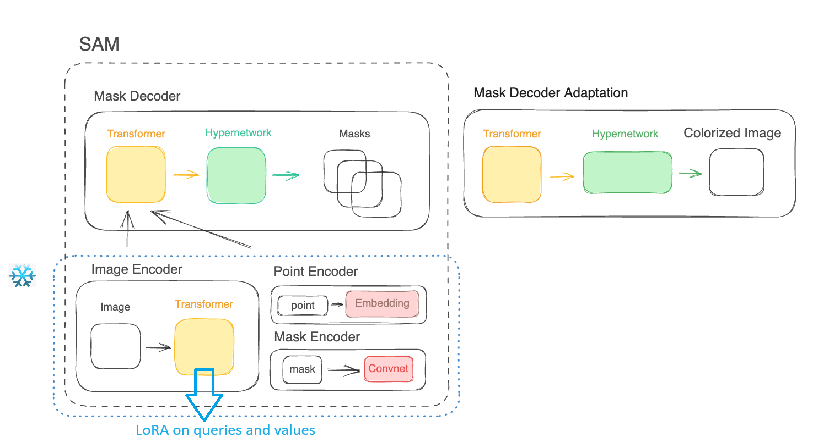
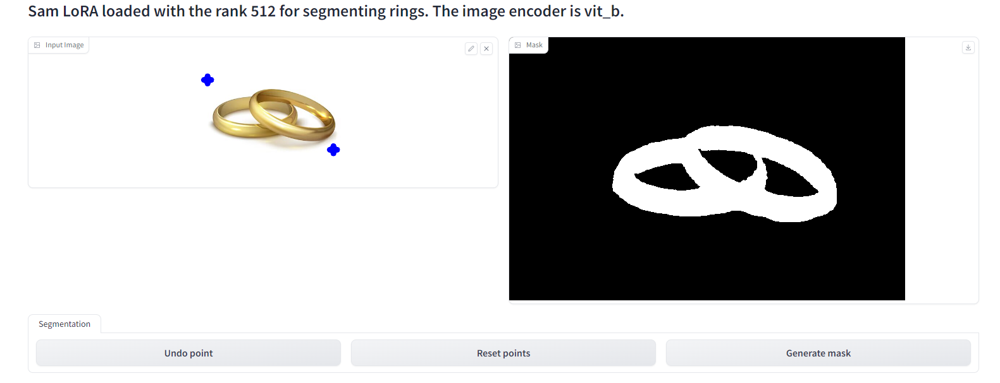
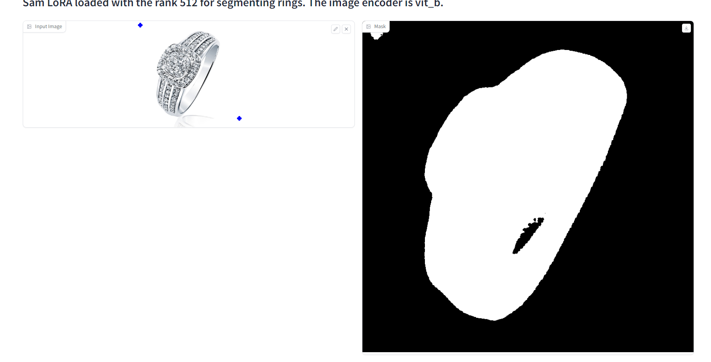

# Segment Your Ring (SYR) - Segment Anything to segment rings (jewelry)

# Introduction

Segment anything is a foundational model released by Meta ([SAM](https://segment-anything.com/)). Pre-trained over 1 billion images, the model shows high performance zero-shot inference.


*Segmentation of an image by SAM*

As good as they are, pre-trained models cannot answer to every segmentation tasks. The model has a large understanding of everything but situation-wise, it can be compromised. I would like to dig deeper in this problem by applying SAM to product packshots. 
Product packshots are mainly done with a unicolor background and the object upfront. Those images tends to have less noise and SAM should be performing really well in contrast of some city image with lots of information. However, we will that it's still a challenging problem.

# Problem
Can we segment jewelry rings used for product packshots ?

# Dataset
I built a dataset of 2 different rings with white background. The 2 types of rings are:
- Single ring
- Pair rings
The single rings have different views and a jewel in it. We can find silver and gold single rings.
The pair rings are 2 rings with one on top of the other. The outline of this can be challenging to segment.
In the training set, I tried to equally split both type of rings. The test set is constitued of 2 images, a single ring and a pair rings.
The dataset for train and test are in :
```
   /dataset
```
The bounding boxes shown in the plots are stored in:
```
   annotations.json
```


*Test set*

# Baseline SAM
The SAM model has 3 blocks: The image encoder, prompt encoder and mask decoder. The mask decoder takes has input the encoded image and encoded prompt to return masks. 


*SAM architecture from paper: https://arxiv.org/abs/2304.02643*

To get our baseline with the dataset, we will first see the capabilities of SAM with zero-shot inference. 

*Baseline SAM predictions on training set*


*Baseline SAM predictions on test set*


As we can see, SAM struggles to segment the ring. The model takes the inside of the ring has part of the object which is wrong. In addition, it has trouble rightly segment the jewelry. To solve this problem, we can fine-tune the model. But there exists efficient ways to fine-tuned large pre-trained models.

# Adapters
The full fine-tuning process can be expensive, specially the bigger the model. An alternative for this is an adapter. Adapters plugs into chosen blocks of the frozen model and is trained. The training of adapters enable the adapted model to solve specific downstream task.This method can help solving our problem to a relatively low computing cost.


*SAM model architecture, source: Benjamin Trom - Finegrain AI*

For my model, I chose to use LoRA adapters.

## LoRA
LoRA is an adapter that is using 2 matrices B and A. The 2 matrices have specific dimensions (input_size, r) and (r, input_size) . By specefiying a rank r < input_size, we reduce the parameters size and try to capture the downstream task with a small enough rank. By doing the dot product B*A, we get a matrix of shape (input_size, input_size) so no information is lost. 

We only need to initialize the matrices, freeze SAM and tune the matrices components so that the frozen model + LoRA adapter model learns to segment rings.

## SAM LoRA
To apply LoRA to SAM, I had to choose a block to apply our adapter. I chose the image encoder because it could be interesting to tune the block that “understand”/encode the images. My LoRA implementation is adapting the **attention modules (queries and values)** of the ViT base by adding 2 nn.Linear in chain after computing queries and values (equivalent of B*A matrices product).


*SAM + LoRA adaption*

Next I will explain the pipeline to train the model.

# Preprocessing
In the original model, a class “SamPredictor” is built to setup an image and predict. However, with this method, we can’t use a batching approach. Therefore, I created a class (Samprocessor) that preprocesses the datasets so that we can use batching for the training. 

The image go trough a longest stride resize and is normalized. Then the image is reshaped to 1024x1024 for the input encoder. Prompt needs to follow the resizing, therefore new coordinates are computed. The resized images and prompts are then passed to the mask decoder that outputs the mask with the highest IoU probability.


*Preprocessing pipeline*

Note: normalization of the image and reshape to 1024x1024 is done in:
```
   /src/segment_anything/modeling/sam.py
```
## Dataloader
```
   /src/dataloader.py
```
The Sam model requires as input a list(dict) object for batch training. To do this, I to created a dataloader that would generate this object. The dictionnary should contain 3 keys: 
- image: The processed image
- boxes: The processed prompt (here bounding box coordinates)
- original_size: The size of the image before transformation (used to transform the image back to the original size after predictions)

I added 2 keys:
- prompt: The bounding box coordinates before transformation
- ground_truth_mask: The ground truth mask

## Processor
```
   /src/processor.py
```
In the dataloader, the processor (Samprocessor class) tranforms the image and prompt so that both are prepared for the image encoder and prompt encoder. It will output the dictionnary containing the keys image, boxes and prompt.


*Processor transformation applied to image and prompt*


# Metrics
I used the Dice Loss to compute the results on the test set. By computing the dice loss, we have access to the Dice similarity coefficient (DSC) by doing: Dice coeff = 1 - Dice Loss.

The dice coefficient gauge the similarity of 2 samples. It is calculated from precision and call (similar to F1-score).
The loss is documented on this website: [Dice loss](https://docs.monai.io/en/stable/losses.html)

# Model selection
Now that our model is defined. We can evaluate the effect of the rank on the model.

## Limitation
I trained the models on colab free. I was only able to train with a batch size of 1 although the code accepts a batch size > 1. Furthermore, I couldn’t add a validation set with early stopping because I would be out of memory. With no validation, there is a risk of overfitting but given my constrains and the number of epochs and the size of the model, we can suppose that the trained models will be the best models.

I trained each models for 50 epochs (chosen arbitrairly), with a batch size of 1.


*Comparison of SAM LoRA for different ranks*

As we can see, the best model is the rank 512. We see that the loss is decreasing has the rank rises.  However, we see a spike at rank 64 that is the worst model. This is an interesting behavior and maybe could be related to the fact that near this particular rank we loose understanding of something.

# Results of the worst model (rank 64)


*SAM LoRA rank 64 predictions on test set*

This is confirmed here, we lost the understanding of double rings. 

# Results of the best model (rank 512)

*SAM LoRA rank 512 predictions on test set*

The best model has clearly a better understanding and answer the task of segmenting the rings.

# Demo
I did a gradio webui to test the best model on picked up images. I prepared a notebook to run the demo locally or in colab. Once loaded, you can upload you images and place 2 points that will form the prompt boundin box. Then, you can generate the mask.
The demo can be launched by running the notebook:
```
   demo.ipynb
```
## Results on some rings

*Demo example 1*

*Demo example 2*

*Demo example 3*

*Demo example 4*

We can see some good segmentation like in demo 1 or demo 2 but it becomes more difficult whe, there is jewelry or reflection on the ring like on demo 4 and 3.

# Folder layout
    .
    ├── dataset
    │   ├── image_before_mask
    │   ├── test
    │   │   ├── images
    │   │   └──  masks
    │   ├── train
    │   │   ├── images
    │   │   └──  masks                 
    ├── docs
    │   └──  images      
    ├── lora_weights
    │   ├── lora_rank2.safetensors
    │   ├── lora_rank4.safetensors
    │   ├── lora_rank6.safetensors
    │   ├── lora_rank8.safetensors
    │   ├── lora_rank16.safetensors
    │   ├── lora_rank32.safetensors
    │   ├── lora_rank64.safetensors
    │   ├── lora_rank128.safetensors
    │   ├── lora_rank256.safetensors
    │   └── lora_rank512.safetensors             
    ├── plots
    │   ├── baseline
    │   │   ├── on_test
    │   │   └──  on_train
    │   ├── best_model_rank_512
    │   │   ├── on_test
    │   │   └──  on_train
    │   ├── worst_model_rank_64
    │   │   ├── on_test
    │   │   └──  on_train
    │   └──  rank_comparison.jpg               
    ├── src
    │   ├── segment_anything
    │   ├── dataloader.py
    │   ├── lora.py
    │   ├── processor.py
    │   └──  utils.py        
    ├── .gitignore
    ├── annotations.json
    ├── app.py
    ├── config.yaml
    ├── demo.ipynb
    ├── inference_eval.py
    ├── inference_plots.py
    ├── poetry.lock
    ├── pyproject.toml
    ├── README.md
    ├── sam_vit_b_01ec64.pth
    ├── train.py
    └── transform_to_mask.py


# Setup
The project use python poetry.

```sh
   pip install poetry
```
```sh
   git clone https://github.com/MathieuNlp/Sam_LoRA.git
   cd Sam_LoRA
```


To install the dependencies use:
```sh
   poetry config virtualenvs.in-project false
```

```sh
   poetry install --all-extras
```

Some dependencies are not loaded with the poetry install, so I added them manually.
```sh
   poetry run pip install --upgrade torch torchvision gradio safetensors opencv-python monai
```

Download the image encoder checkpoint (vit-b)
```sh
   wget https://dl.fbaipublicfiles.com/segment_anything/sam_vit_b_01ec64.pth
```

# Run training
To run the training, use:
```sh
   poetry run python train.py
```

# Run Inference

## Plot inference
To plot the inference of the model, run:
```sh
   poetry run python inference_plots.py
```

# Acknowledgments
Thank you to:
- Niels Rogge - HuggingFace: https://github.com/NielsRogge/Transformers-Tutorials/blob/master/SAM/Fine_tune_SAM_(segment_anything)_on_a_custom_dataset.ipynb
- JamesQFreeman: https://github.com/JamesQFreeman/Sam_LoRA
- Denis Brulé, Benjamin Trom - Finegrain AI

# Author
Mathieu Nalpon

