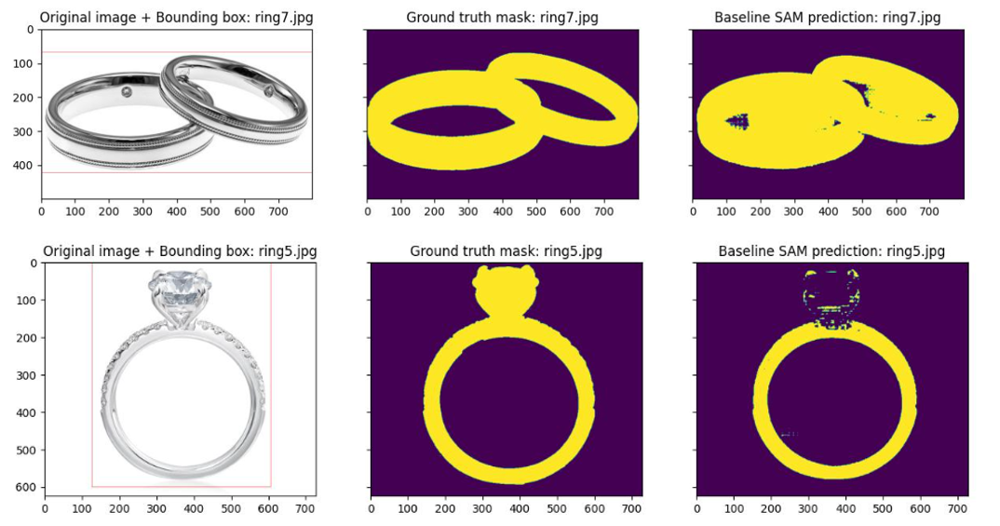
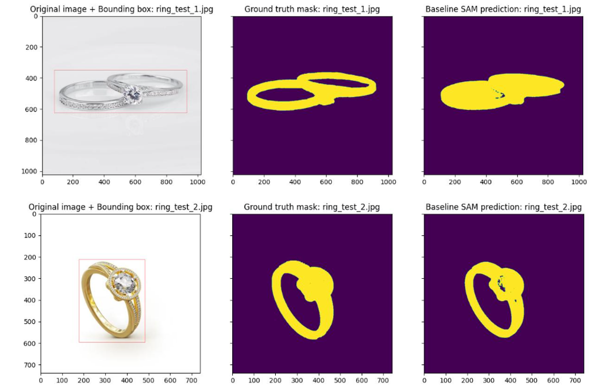
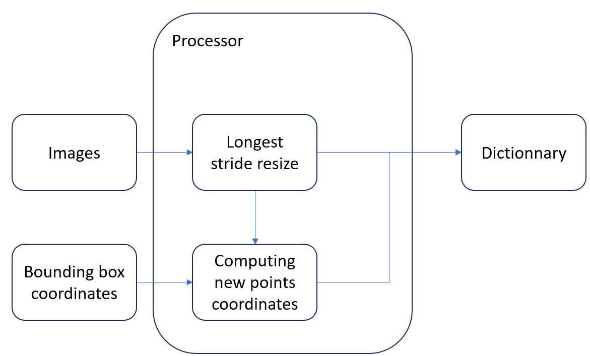
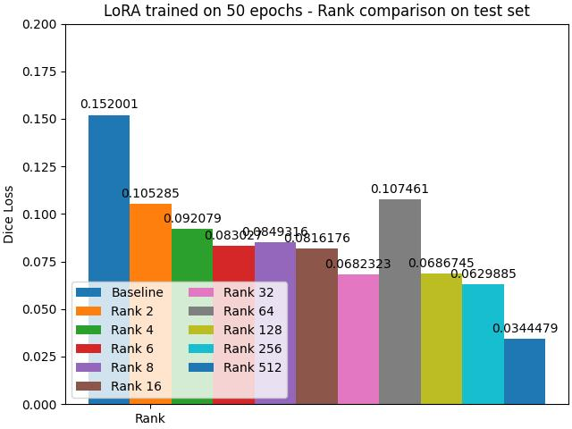
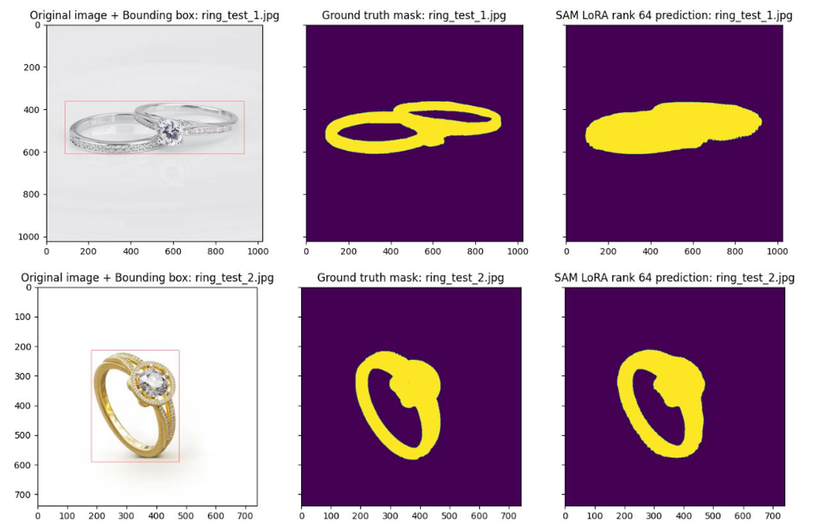
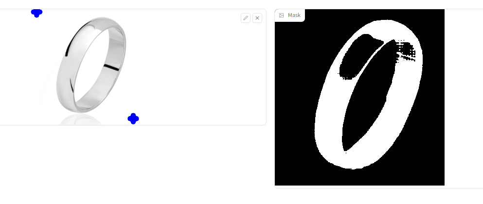
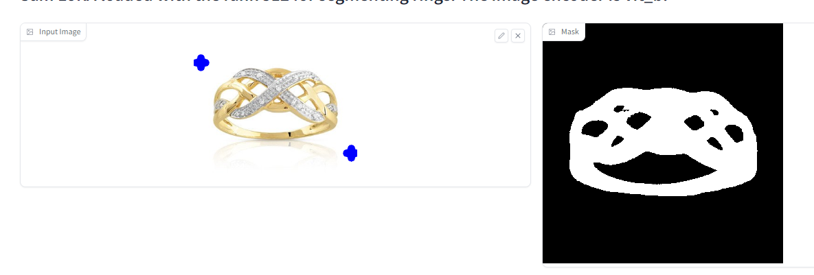

# Segment Your Ring (SYR) - Segment Anything to segment rings (jewelry)

# Introduction

Segment anything is a foundational model released by Meta ([SAM](https://segment-anything.com/)) and is pre-trained over 1 billion images. The model shows high quality zero-shot inference.


*Segmentation of an image by SAM*

As good as they are, foundational models cannot answer to every segmentation tasks. The model has a large understanding of everything but situation-wise, SAM could perform poorly. I dug deeper into this problem by applying SAM to product packshots. 
Product packshots are mostly done with an object upfront and a one-color background. Those images have less noise than regular images and therefore SAM should provide greate results. However, we will see that in the application of jewelry, SAM as difficulties segmenting.

# Problem
Can we segment jewelry rings used in product packshots ?

# Dataset
I built a dataset of 2 different rings with white background. The 2 types of rings are:
- Single ring
- Pair rings

The single rings have different view angle and some as a jewel on it. The material can also change between gold and silver.

The pair rings are 2 rings with one on top of the other. The outline can be challenging to segment. Same as the single ring, the material are either gold or silver.
I equally splited the rings type in the training set. The test set is composed of 2 images: a single ring and a pair rings.

 \
*Test set*

## Dataset folders
The dataset for train and test can be found in:
```
   /dataset/train
```
```
   /dataset/test
```
## Mask creation
In each datasets, we have the images and the masks. To create the masks, I used Paint3D to outline the rings and applied a black background to facilitate the binary masking. The pre-transformed image masks are store in:
```
   /dataset/image_before_mask
```
Then I passed each pre-transformed image masks into a function that convert it into a binary mask. 
```
   transform_to_mask.py
```
 \
*Test set masks*

## Annotations
I added an annotation file that groups the bounding box and ground truth mask for each images (for inference). During the training, I extracted the bounding boxes out of the ground truth masks.
```
   annotations.json
```

# Configuration file
I created a configuration file to regroup the paths, training hyperparameters and loading of the model.
```sh
   config.yaml
```

# Baseline SAM

*SAM architecture from paper: https://arxiv.org/abs/2304.02643*

The SAM model has 3 main components: The image encoder, prompt encoder and mask decoder. The mask decoder takes has input the encoded image and encoded prompt to return masks. For our application, I choose to only take the mask with the highest IoU score.

Let's see the performance of SAM on our train and test set.

*Baseline SAM predictions on training set*



*Baseline SAM predictions on test set*

Every predictions of the baseline model can be found in:
```sh
   /plots/baseline
```
As we can see, SAM struggles to segment the rings. The model takes the inside of the ring has part of the object which is wrong. In addition, it has trouble to correctly segment the jewelry. To solve this problem, we can fine-tune the model with our training set.

# Adapters
The full fine-tuning process can be expensive, specially the bigger the model. An alternative for this is an adapter. Adapters plugs into chosen blocks a frozen model and is trained. The training of adapters enable to solve specific downstream tasks. This method can help solving our problem to a relatively low computing cost.


*SAM model architecture, source: Benjamin Trom - Finegrain AI*

For my model, I chose to use LoRA adapters.

## LoRA
LoRA is an adapter that is using 2 matrices B and A. The 2 matrices have specific dimensions (input_size, r) and (r, input_size) . By specifying a rank r < input_size, we reduce the parameters size and try to capture the task with a small enough rank. By doing the dot product B*A, we get a matrix of shape (input_size, input_size) so no information is lost but the model we learn a new representation.

For our application, we only need to initialize the matrices, freeze SAM and train the model components so that the frozen model + LoRA learns to segment rings.

## SAM LoRA
To apply LoRA to SAM, I had to choose a block to apply our adapter. I chose the image encoder because it could be interesting to tune the block that “understand”/encode the images. My LoRA implementation is adapting the **attention modules (queries and values)** of the ViT base by adding 2 nn.Linear in chain after computing queries and values (equivalent of B*A matrices product).
The lora adapter is in:
```sh
   /src/lora.py
```

To create an instance of SAM LoRA, you can call (ex. rank 8):
```python
   from src.lora import LoRA_sam

   sam = build_sam_vit_b(checkpoint="$PATH_TO_VITB_CHECKPOINT$")
   sam_lora_class = LoRA_sam(sam, rank=8)
   sam_lora = sam_lora_class.sam
```


*SAM + LoRA adaption*

Next I will explain the preprocessing pipeline to train the model.

# Preprocessing
In the original model, a class “SamPredictor” is built to setup an image and predict. However, with this method, we can’t use a batching approach for training. Therefore, I created a class (Samprocessor) that preprocess the datasets and outputs a list(dict) object necessary for SAM.  

Firstly, the image go trough a longest stride resize and is normalized. Then the image is reshaped to 1024x1024 for the input encoder. The prompt (bounding box) needs to follow the resizing, therefore new coordinates are computed. The resized images and prompts are then passed to the mask decoder that outputs the mask with the highest IoU probability. Finally, the mask is reshaped to the original size of the image.


*Preprocessing pipeline*

Note: Normalization and reshape to 1024x1024 of the image is done in:
```
   /src/segment_anything/modeling/sam.py
```
## Dataloader
```
   /src/dataloader.py
```
The Sam model requires as input a list(dict) object to process the input. To get this, I to created a dataloader that would generate this object. The dictionnary must contain 3 keys: 
- image: The processed image (Longest stide resize)
- boxes: The processed prompt (here bounding box new coordinates)
- original_size: The size of the image before transformation (used to transform the image back to the original size after predictions)

I added 2 keys:
- prompt: The bounding box coordinates before transformation
- ground_truth_mask: The ground truth mask

## Processor
```
   /src/processor.py
```
In the dataloader, the processor (Samprocessor class) tranforms the image and prompt so that both are prepared for the image encoder and prompt encoder. It will output the dictionnary containing the keys image, boxes and prompt.


*Processor transformation applied to image and prompt*


# Metrics
To train and test the model performances on the test set, I used the Dice Loss. By computing the dice loss, we have access to the Dice Similarity Coefficient (DSC) by doing: Dice coeff = 1 - Dice Loss.

The dice coefficient gauge the similarity of 2 samples. It is calculated from precision and recall (similar to F1-score).
The loss is documented on this website: [Dice loss](https://docs.monai.io/en/stable/losses.html)

# Model selection
Now that our model is defined. We can evaluate the effect of the rank on the segmentation.

## Limitation
I trained the models on colab free. I was only able to train with a batch size of 1 although the code accepts a batch size greater than 1. Furthermore, I couldn’t add a validation set because I would be out of memory. With no validation, there is a risk of overfitting but given my constrains and to simplify, I supposed that the trained models will be the best models.

I trained each models for 50 epochs (chosen arbitrairly), with a batch size of 1.

## Comparison
 \
*Comparison of SAM LoRA for different ranks*

As we can see, the best model is the rank 512. We see that the loss is decreasing has the rank rises.  However, we see a spike at rank 64 that is the worst model for the LoRAs. This is an interesting behavior and may be related to the fact that near this particular rank we loose understanding of something.

# Results of the worst model (rank 64)


*SAM LoRA rank 64 predictions on test set*

We see that the model lost some understanding of pair rings. 

# Results of the best model (rank 512)

*SAM LoRA rank 512 predictions on test set*

The best model has clearly a better understanding and answer the task of segmenting the rings.

# Demo
I did a gradio webui to test the models on picked up images. The rank will be the same as the one written in the configuration file. I prepared a notebook to run the demo. 
The demo can be launched by running the notebook:
```
   demo.ipynb
```
Once loaded, you can upload your images and place 2 points that will form the prompt bounding box. Then, you can generate the mask.

## Results on some rings

*Demo example 1*

*Demo example 2*

*Demo example 3*

*Demo example 4*

We can see some good segmentation like in demo 1 or demo 2 but it becomes more difficult when there is a jewelry or reflection on the ring like on demo 4 and demo 3.

# Conclusion/Discussion

Using adapters we partially answered the task of segmenting rings. In the demo examples we saw that the model still struggles to caputre all the rings. This could be because the training dataset is small (8 images).
To improve the model, we can add checkpoint and early stopping with a validation set to prevent from overfitting. In addition, doing data augmentation could be interesting to strengthen the model generalization.

# Folder layout
    .
    ├── dataset                              # Folder containing the datasets
    │   ├── image_before_mask                # Images with black background to easily transform to masks
    │   ├── test                             # Test set
    │   │   ├── images                       # Images from the test set
    │   │   └── masks                        # Masks from the test set
    │   ├── train                            # Train set
    │   │   ├── images                       # Images from the train set  
    │   │   └── masks                        # Masks from the train set                 
    ├── docs                                 # Folder containing ressources for the README
    │   └── images                           # Images used in the README and some additional result plots      
    ├── lora_weights                         # Folder containing all the LoRA with different ranks
    │   ├── lora_rank2.safetensors           # Weights of trained LoRA for rank 2
    │   ├── lora_rank4.safetensors           # Weights of trained LoRA for rank 4
    │   ├── lora_rank6.safetensors           # Weights of trained LoRA for rank 6
    │   ├── lora_rank8.safetensors           # Weights of trained LoRA for rank 8
    │   ├── lora_rank16.safetensors          # Weights of trained LoRA for rank 16
    │   ├── lora_rank32.safetensors          # Weights of trained LoRA for rank 32
    │   ├── lora_rank64.safetensors          # Weights of trained LoRA for rank 64
    │   ├── lora_rank128.safetensors         # Weights of trained LoRA for rank 128
    │   ├── lora_rank256.safetensors         # Weights of trained LoRA for rank 256
    │   └── lora_rank512.safetensors         # Weights of trained LoRA for rank 512           
    ├── plots                                # Folder with the predictions plots
    │   ├── baseline                         # Predictions of the baseline model
    │   │   ├── on_test                      # Predictions on test set
    │   │   └── on_train                     # Predictions on train set
    │   ├── best_model_rank_512              # Predictions of the best LoRA model
    │   │   ├── on_test                      # Predictions on test set
    │   │   └── on_train                     # Predictions on train set
    │   ├── worst_model_rank_64              # Predictions of the worst Lora model
    │   │   ├── on_test                      # Predictions on test set
    │   │   └── on_train                     # Predictions on train set
    │   └── rank_comparison.jpg              # Bar plot comparing the dice loss of each models              
    ├── src                                  # Folder containing the python scripts for the pipeline
    │   ├── segment_anything                 # Segment Anything model
    │   ├── dataloader.py                    # Dataset and data collator
    │   ├── lora.py                          # LoRA model class and save/load model
    │   ├── processor.py                     # Processor that transforms the images/prompts
    │   └── utils.py                         # Utility functions 
    ├── .gitignore
    ├── annotations.json                     # Annotations fof mask path and bounding box for each images
    ├── app.py                               # Script that define the gradio webui
    ├── config.yaml                          # Configuration file for paths, number of epochs and batch size
    ├── demo.ipynb                           # Demo notebook
    ├── inference_eval.py                    # Plots comparing baseline model with the LoRA models on test set
    ├── inference_plots.py                   # Plots the prediction on train or test set for a model (hard coded inside)
    ├── poetry.lock                          # Poetry lock file
    ├── pyproject.toml                       # Poetry toml file
    ├── README.md                            
    ├── sam_vit_b_01ec64.pth                 # Checkpoint of the image encoder (ViT base) got with wget
    ├── train.py                             # Training script
    └── transform_to_mask.py                 # Transforms the images on image_before_mask folder into masks


# Setup
The project use python poetry.

```sh
   pip install poetry
```
```sh
   git clone https://github.com/MathieuNlp/Sam_LoRA.git
```
```sh
   cd Sam_LoRA
```

To install the dependencies use:
```sh
   poetry config virtualenvs.in-project false
```

```sh
   poetry install --all-extras
```

Some dependencies are not loaded with the poetry install, so I added them manually.
```sh
   poetry run pip install --upgrade torch torchvision gradio safetensors opencv-python monai
```

Download the image encoder checkpoint (vit-b)
```sh
   wget https://dl.fbaipublicfiles.com/segment_anything/sam_vit_b_01ec64.pth
```

# Run training
To run the training, use:
```sh
   poetry run python train.py
```

# Run inference

## Plot inference
To plot the inference of the model, run:
```sh
   poetry run python inference_plots.py
```

# Acknowledgments
Thank you to:
- Niels Rogge - HuggingFace: https://github.com/NielsRogge/Transformers-Tutorials/blob/master/SAM/Fine_tune_SAM_(segment_anything)_on_a_custom_dataset.ipynb
- JamesQFreeman: https://github.com/JamesQFreeman/Sam_LoRA
- Denis Brulé, Benjamin Trom - Finegrain AI

# Author
Mathieu Nalpon

